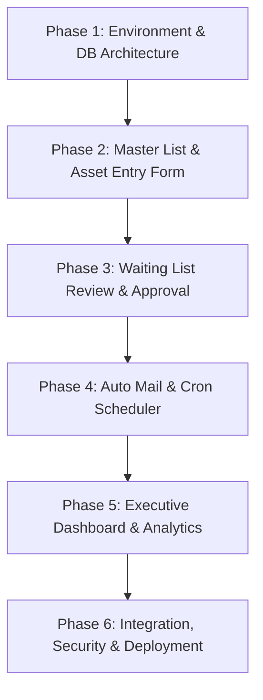

# Roadmap & Implementation Plan: QM Asset Control Center System

เอกสารนี้ระบุรายละเอียดโครงสร้างข้อมูล ฟังก์ชันระบบ และลำดับขั้นตอนในการเตรียมตัวเขียนโค้ดสำหรับสร้างระบบ **QM Asset Control Tracking System** (Hana Microelectronics Lamphun) ซึ่งรวบรวมจากข้อมูลในไฟล์ [QM Asset Control Center.xlsx](file:///e:/Project/QM Asset Control Center/QM Asset Control Center.xlsx)

---

## 1. ภาพรวมระบบและวัตถุประสงค์ (System Overview)
ระบบ **QM Asset Control Tracking System** มีเป้าหมายในการ:
- **รวมศูนย์ข้อมูลสินทรัพย์ (Centralized Data):** ลดการถือข้อมูลกระจัดกระจายหลายไฟล์
- **การติดตามแบบ Real-time:** แสดงสถานะอุปกรณ์, อายุปัจจุบัน, และประมาณการงบประมาณจัดซื้อทดแทน
- **การจัดการมูลค่าทางบัญชี (Book Value & Depreciation):** คำนวณค่าเสื่อมราคาตามเกณฑ์ **7-Year Useful Life** อัตโนมัติ
- **ระบบทบทวนและแจ้งเตือน (Review & Auto Mail):** ส่ง Email แจ้งเตือน Owner ให้ทบทวนสินทรัพย์ปีละ 2 ครั้ง (เมษายน และ สิงหาคม)

---

## 2. โครงสร้างข้อมูลหลัก (Data Schema & Attributes)

สินทรัพย์ 1 รายการประกอบด้วยฟิลด์ข้อมูลดังนี้:

| ชื่อฟิลด์ (Field Name) | ประเภทข้อมูล | เงื่อนไข / การจัดการ |
| :--- | :--- | :--- |
| **ITEM / Asset ID** | Running Number / Primary Key | สร้างอัตโนมัติ |
| **Machine Name** | String | Required |
| **Brand / Model** | String / String | Required |
| **Serial No.** | String | Required |
| **BOI No. / Asset No. / Machine No.** | String | Required (ระบุ N/A ได้หากไม่มี) |
| **Calibration ID** | String | Required |
| **Machine Type** | Enum / Dropdown | `Analysis Equipment`, `Measuring&Test Equipment`, `Machine` |
| **Received Date** | Date | Required |
| **AGE (YR)** | Number (Calculated) | คำนวณอัตโนมัติจาก วันปัจจุบัน - Received Date |
| **Invoice No. / INV. COST** | String / Decimal | Required |
| **Currency** | Enum | `USD`, `THB` ฯลฯ |
| **AMOUNT (THB)** | Decimal (Calculated) | แปลงเป็น THB อัตโนมัติ |
| **Owner** | String / User ID | Required |
| **Location / Plant / Floor / Area** | String | Required (เช่น FA Lab, OP1S, LPN2, Floor 4 ฯลฯ) |
| **Book Value (THB)** | Decimal | ทีม CAL / Admin กรอกเมื่อทบทวนในหน้า Waiting List |
| **Status** | Enum | `Good`, `Fair`, `Poor`, `Discontinue part`, `Written off` |
| **Require (Y/N)** | Enum | `Y`, `N` |
| **REMARK** | Text | หมายเหตุเพิ่มเติม |

---

## 3. ลำดับขั้นตอนการพัฒนาโปรเจกต์ (Step-by-Step Development Phases)

### Phase 1: การเตรียมโครงสร้างโปรเจกต์และออกแบบฐานข้อมูล (Setup & Architecture)
- [ ] 1.1 เลือกและติดตั้ง Framework (เช่น Frontend: React/Next.js/Vite + Backend: Node.js/Express หรือ Python/FastAPI)
- [ ] 1.2 วางโครงสร้าง Database (Tables: `assets`, `users`, `roles`, `categories`, `review_logs`, `external_sync`)
- [ ] 1.3 สร้างสูตรคำนวณพื้นฐาน (Age Calculation, USD to THB Conversion, 7-Year Useful Life Depreciation)

### Phase 2: ระบบจัดการสินทรัพย์หลัก (QM Asset Master List & Add New Form)
- [ ] 2.1 หน้าจอ **QM Asset Master List**: ตารางแสดงรายการสินทรัพย์พร้อมระบบค้นหา (Search), กรอง (Filter), เรียงลำดับ (Sort) และแบ่งหน้า (Pagination)
- [ ] 2.2 หน้าจอ **Add NEW Asset Form**: ฟอร์มลงทะเบียนสินทรัพย์ใหม่ บังคับกรอกทุกช่อง (เว้น Book Value ไว้รออนุมัติ)
- [ ] 2.3 ระบบสิทธิ์ผู้ใช้งาน (Role-Based Access Control):
  - **Level 1 (Owner):** ดูและแก้ไขได้เฉพาะสินทรัพย์ของตนเอง
  - **Level 2 (Admin / QM Lab Mgr / HOD):** ดูและแก้ไขได้ทั้งหมด

### Phase 3: ระบบอนุมัติและทบทวนสินทรัพย์ (Waiting List Review Workflow)
- [ ] 3.1 หน้าจอ **Waiting List Review**: รายการสินทรัพย์ใหม่ที่ส่งมาจากฟอร์ม หรือมาจากระบบภายนอก (QM PM Web, Hana Equipment Web, Buy-off Web)
- [ ] 3.2 ปุ่ม **Update / Review**: สำหรับทีม CAL / Admin เพื่อตรวจสอบความถูกต้องและกรอก **Book Value (THB)**
- [ ] 3.3 เมื่ออนุมัติแล้ว ข้อมูลจะย้ายเข้าสู่ **QM Asset Master List** อัตโนมัติ

### Phase 4: ระบบแจ้งเตือนอีเมลอัตโนมัติ (Setup Auto Mail & Cron Job)
- [ ] 4.1 พัฒนา Cron Job / Scheduler ทำงานปีละ 2 ครั้ง (เดือนเมษายน สำหรับรอบพฤษภาคม, เดือนสิงหาคม สำหรับรอบกันยายน)
- [ ] 4.2 ระบบส่ง Email Follow-up ถี่ขึ้น (D-7 ถึง D-0) จนกว่ารายการค้างใน Waiting List จะถูกทบทวนครบถ้วน
- [ ] 4.3 เชื่อมต่อกับระบบ Email Template (HTML Mail พร้อมปุ่ม Direct Link ไปยังหน้าทบทวน)

### Phase 5: สถิติและหน้าจอแดชบอร์ด (Asset Management Dashboard)
- [ ] 5.1 Card สรุปตัวเลขสำคัญ (Total Assets, Total Book Value, Count by Status, Pending Reviews)
- [ ] 5.2 กราฟแสดงสัดส่วนสินทรัพย์ตาม Machine Type, Location และอายุการใช้งาน (Age Breakdown)
- [ ] 5.3 รายงานประมาณการงบประมาณจัดซื้อทดแทน (Capital Expenditure & Replacement Forecast)

### Phase 6: การเชื่อมต่อระบบภายนอก การทดสอบ และปรับแต่ง (Integration & Deployment)
- [ ] 6.1 เชื่อมต่อ Sync Data กับระบบภายนอก (QM Center, PMQM Online, Hana Equipment Web)
- [ ] 6.2 ทดสอบความปลอดภัย (Security Check) และระบบล็อกอิน (Authentication System)
- [ ] 6.3 ดำเนินการทดสอบระบบร่วมกับผู้ใช้ (UAT) และจัดทำคู่มือการใช้งาน

---

## 4. แนะนำเทคโนโลยีในการสร้างโปรเจกต์ (Recommended Tech Stack)
- **Frontend:** React / Vite หรือ Next.js (TypeScript, Tailwind CSS, Lucide Icons, Recharts/Chart.js)
- **Backend:** Node.js (Express/NestJS) หรือ Python (FastAPI/Django)
- **Database:** PostgreSQL หรือ MySQL
- **Email & Scheduler:** Node-cron / Celery + Nodemailer / SMTP Service

---
*เอกสารนี้จัดทำขึ้นโดยอ้างอิงจากความต้องการในไฟล์ QM Asset Control Center.xlsx เพื่อเตรียมพร้อมสำหรับการสร้างโปรเจกต์*
